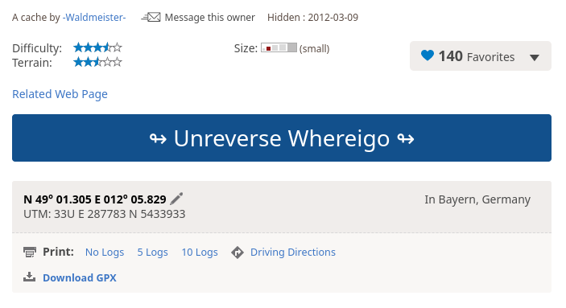

# Reverse Whereigo solver

Solve reverse whereigo caches from the confort of your home!

## How to use it

- Fisrt, make sure user-script web browser extension is installed.
Greasemonkey and Tampermonkey are good trusted choices supported in majority of the browsers.

- Second, install current version of the [`revwherigo` scirpt](https://github.com/avogadogc/revwherigo/raw/master/revwherigo.user.js).

- Finally, click the buton on a reverse whereigo geocache to have the final coordinates updated.

